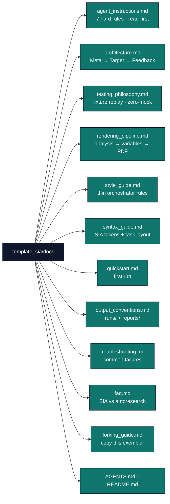

# `template_sia/docs/`

Documentation hub for the SIA harness exemplar.

## Quick links

| File | Purpose |
| --- | --- |
| [`agent_instructions.md`](agent_instructions.md) | Hard rules for agents modifying this project |
| [`architecture.md`](architecture.md) | Layer 1 / Layer 2 split and generation artifact tree |
| [`testing_philosophy.md`](testing_philosophy.md) | Fixture replay default; live Ollama opt-in |
| [`rendering_pipeline.md`](rendering_pipeline.md) | Analysis scripts → manuscript tokens → PDF |
| [`style_guide.md`](style_guide.md) | Thin orchestrator and determinism conventions |
| [`syntax_guide.md`](syntax_guide.md) | `{{SIA_*}}` tokens and task directory layout |
| [`quickstart.md`](quickstart.md) | First-run commands |
| [`output_conventions.md`](output_conventions.md) | Where loop artifacts land on disk |
| [`troubleshooting.md`](troubleshooting.md) | Diagnostic flow for failed stages |
| [`faq.md`](faq.md) | SIA harness vs AutoResearch; live mode |
| [`forking_guide.md`](forking_guide.md) | Copy this exemplar for a new harness task |
| [`AGENTS.md`](AGENTS.md) | Agent-oriented walkthrough of this hub |

## Audience entry points

- **First-time agent** → [`agent_instructions.md`](agent_instructions.md), then [`architecture.md`](architecture.md)
- **New task under `tasks/`** → [`syntax_guide.md`](syntax_guide.md) + [`../../../../infrastructure/sia/AGENTS.md`](../../../../infrastructure/sia/AGENTS.md)
- **Pipeline / PDF** → [`quickstart.md`](quickstart.md) + [`rendering_pipeline.md`](rendering_pipeline.md)
- **Fork for your benchmark** → [`forking_guide.md`](forking_guide.md)

## See also

- [`../README.md`](../README.md) — project overview
- [`../AGENTS.md`](../AGENTS.md) — module map
- [`../../../../infrastructure/sia/README.md`](../../../../infrastructure/sia/README.md) — Layer 1 API
- [`../../../../docs/guides/fork-an-exemplar.md`](../../../../docs/guides/fork-an-exemplar.md) — pick the right exemplar
