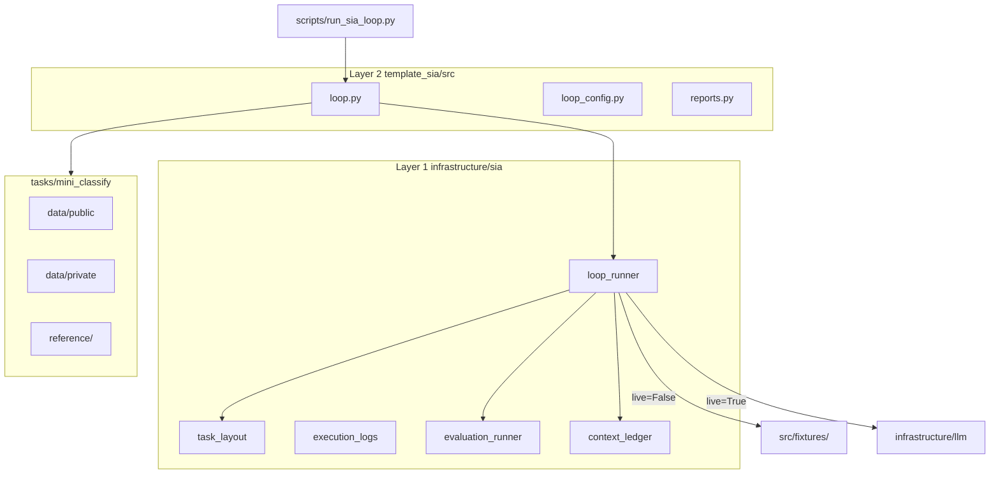

# Architecture — template_sia

## Two-layer split



| Layer | Location | Owns |
| --- | --- | --- |
| Layer 1 | `infrastructure/sia/` | Task validation, evaluation subprocess, context ledger, generation state machine |
| Layer 2 | `projects/templates/template_sia/src/` | Project config, fixture paths, manuscript variables, task-specific reference agent |
| Orchestration | `scripts/` | CLI flags (`--live-sia`), stdout paths for manifest collection |

## Generation artifact tree

Each run writes:

```
output/runs/run_{id}/
  context.md
  run_summary.json
  gen_{n}/
    target_agent.py
    agent_execution.json
    improvement.md
    results.json
```

Fixture replay copies recorded artifacts from `src/fixtures/recorded_generations/gen_{n}/` when `live=False`.

## Comparison with template_autoresearch_project

| | `template_sia` | `template_autoresearch_project` |
| --- | --- | --- |
| Goal | Benchmark self-improvement harness | Readiness / evidence / claim gates |
| Loop | Meta → Target → Feedback generations | AutoResearch plan validation |
| Default path | Fixture replay | Deterministic ML loop fixtures |

Do not merge these loops — they answer different research questions.
