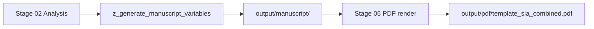

# Rendering pipeline — template_sia

## Phases



| Phase | Script | Output |
| --- | --- | --- |
| 1. Loop | `scripts/run_sia_loop.py` | `output/runs/run_1/gen_*/`, `output/reports/sia_loop_report.md` |
| 2. Variables | `scripts/z_generate_manuscript_variables.py` | `output/data/manuscript_variables.json`, `output/manuscript/*.md` |
| 3. Render | root `scripts/03_render_pdf.py` | `output/pdf/template_sia_combined.pdf` |
| 4. Copy | root `scripts/05_copy_outputs.py` | `output/templates/template_sia/` |

## Config controls

`manuscript/config.yaml`:

| Block | Keys | Effect |
| --- | --- | --- |
| `sia:` | `task_name`, `max_generations`, `live`, `target_timeout_sec`, `llm_model` | Loop behaviour (registered schema extension) |
| `paper:` | `title`, `version` | Title page and tokens |
| `publication:` | `doi`, `year` | Publishing metadata |

## Full pipeline

```bash
uv run python scripts/execute_pipeline.py --project templates/template_sia --core-only --skip-infra
```

Analysis must complete before variables generation — `z_generate_manuscript_variables.py` fails fast if `output/runs/run_1/run_summary.json` is missing.
