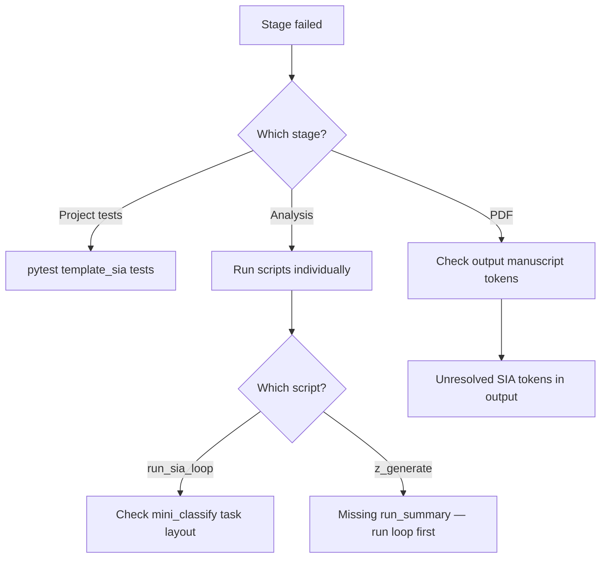

# Troubleshooting — template_sia

## Project tests fail with `unrecognized arguments: --timeout`

Add `pytest-timeout` to project dev dependencies (already in `pyproject.toml`). Run `uv sync --extra dev` inside the project directory.

## `ModuleNotFoundError: No module named 'PIL'`

The variables script must not import `infrastructure.rendering` package init. Use `src/reports.write_resolved_manuscript_tree` (lazy load of `manuscript_injection.py` only).

## `Unknown config key 'sia'`

Ensure `src/loop_config.py` registers `register_project_schema_extension("template_sia", {"sia": dict})`.

## Analysis: missing `run_summary.json`

Run `uv run python projects/templates/template_sia/scripts/run_sia_loop.py` before `z_generate_manuscript_variables.py`.

## Live mode hangs or fails

- Confirm `ollama serve` is running
- Use `@pytest.mark.requires_ollama` tests locally only
- Keep `target_timeout_sec` bounded in config

## Drift: missing `.gitignore`

Exemplars must ship `projects/templates/template_sia/.gitignore` and appear in root `.gitignore` allowlist negations.
