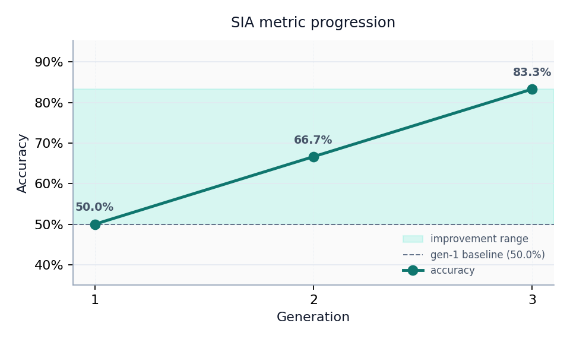

# Results {#sec:results}

@tbl:sia-metrics summarizes fixture-replay metrics for the bundled run.

{{SIA_METRICS_TABLE}}

: SIA generation metrics (fixture replay). {#tbl:sia-metrics}

Metric delta (final − first generation): {{SIA_METRIC_DELTA}}.

Final injected token: {{SIA_FINAL_METRIC_NAME}}={{SIA_FINAL_METRIC_VALUE}} (n={{SIA_FINAL_N_SAMPLES}}).

{#fig:sia-metric-progression width=85%}
