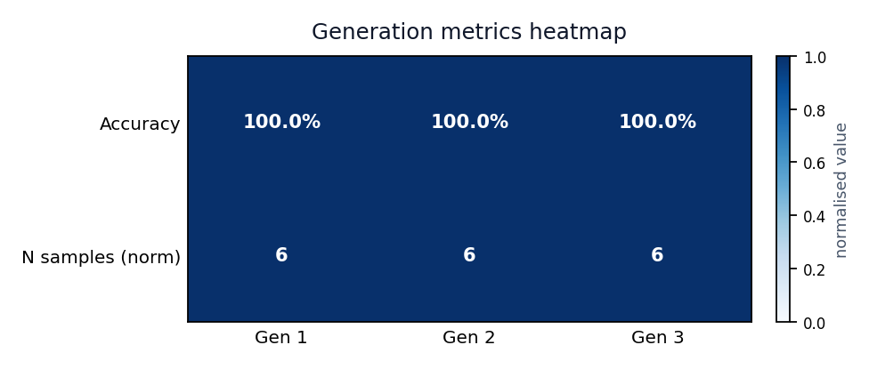
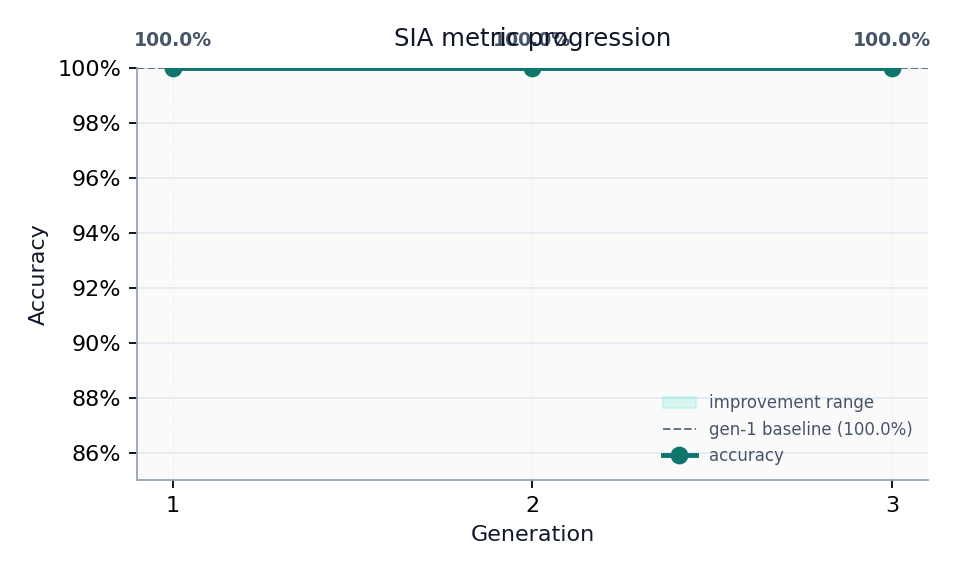
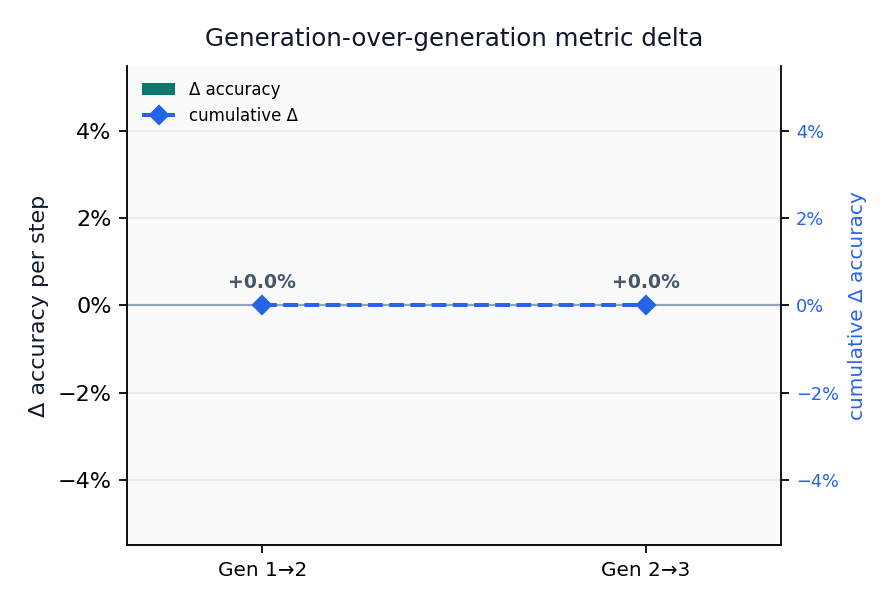

# Abstract {#sec:abstract}

This exemplar documents **template_sia**, a deterministic implementation of the Self-Improvement Agent (SIA) harness contract described in [@sia2026]. The default pipeline replays fixture-backed generations for the `mini_classify` task; opt-in live mode runs bounded target subprocesses and optional Ollama-backed meta/feedback steps.

**Run snapshot.** Task `mini_classify`, run 1, 3 generation(s), live=false. Final accuracy=1.0000 over 6 held-out samples. Values are injected by `scripts/z_generate_manuscript_variables.py` after analysis.

**Keywords:** self-improvement agents, benchmark harness, reproducible evaluation, agent loops

---

# Introduction {#sec:introduction}

This exemplar ships **template_sia**, a deterministic research harness for Self-Improvement Agent (SIA) loops [@sia2026]. It documents how the template repository separates generic orchestration (`infrastructure/sia/`) from a reproducible project surface (`projects/templates/template_sia/`) without vendoring the upstream [upstream SIA orchestrator repository](https://github.com/hexo-ai/sia).

Compared with the AutoResearch exemplar, SIA focuses on **meta → target → feedback** generations with public/private task splits rather than candidate-model search and readiness gates. Default CI replays fixture-backed generations; live mode remains opt-in.

**Scope.** The bundled `mini_classify` task is a threshold classifier on one feature column. Results demonstrate harness wiring and artifact contracts—not state-of-the-art accuracy.

**Run contract.** Task `mini_classify`, run 1, up to 3 generation(s), live=false.

---

# Methodology {#sec:methodology}

## SIA loop

The harness implements a three-agent cycle:

1. **Meta** — proposes or seeds a target agent for generation $n$.
2. **Target** — runs against public task data and writes `agent_execution.json`.
3. **Feedback** — reads private evaluation metrics and proposes improvements for generation $n+1$.

{#fig:sia-loop-topology width=90%}

Artifacts land under `output/runs/run_{id}/gen_{n}/` with `target_agent.py`, `agent_execution.json`, optional `improvement.md`, and canonical `results.json`.

## Task layout

Each task exposes:

- `data/public/` — agent-visible instructions and data (`task.md`, `train.csv`, `evaluate.py`).
- `data/private/` — held-out labels for evaluation only.
- `reference/reference_target_agent.py` — deterministic baseline.

The exemplar task `mini_classify` is a threshold classifier on a single feature column.

## Determinism contract

When `sia.live: false` (default), generations replay recorded fixtures from `src/fixtures/recorded_generations/`. CI never executes generated agent code or calls external LLM APIs.

Pass `--live-sia` to `scripts/run_sia_loop.py` for bounded subprocess execution and optional Ollama feedback when a model is configured.

## Per-generation metric overview

The heatmap below provides a compact overview of per-generation accuracy and sample
count, enabling at-a-glance comparison across runs.

{#fig:sia-generation-heatmap width=80%}

---

# Results {#sec:results}

@tbl:sia-metrics summarizes fixture-replay metrics for the bundled run.

| Gen | Metric | Value | N |
| --- | --- | ---: | ---: |
| 1 | accuracy | 1.0000 | 6 |
| 2 | accuracy | 1.0000 | 6 |
| 3 | accuracy | 1.0000 | 6 |

: SIA generation metrics (fixture replay). {#tbl:sia-metrics}

Metric delta (final − first generation): 0.0000.

Final injected token: accuracy=1.0000 (n=6).

{#fig:sia-metric-progression width=85%}

## Threshold robustness control

The recorded target agents genuinely apply the proposed thresholds 0.5, 0.3,
and 0.25. All three lie inside this toy dataset's clean separation gap and
therefore score 1.0. The zero generation-over-generation delta is an important
negative result: the harness records feedback and code variation without
fabricating an improvement signal where the evaluation cannot distinguish one.

{#fig:sia-improvement-delta width=80%}

---

# Conclusion {#sec:conclusion}

template_sia demonstrates how to embed the SIA harness contract in the Research Project Template without vendoring upstream orchestration code. Layer 1 (`infrastructure/sia/`) owns task validation, evaluation, context logging, and the generation state machine; Layer 2 wires a minimal classification task, fixture replay, and manuscript tokens.

**Non-claims.** This tree is a harness and documentation exemplar. Fixture-replay metrics (final accuracy=1.0000) validate wiring only—they are not evidence of state-of-the-art self-improvement. Live self-modification and external LLM calls remain opt-in; default CI never executes generated agent code or claims benchmark parity with [@sia2026].

---

# References {#sec:references}

See `references.bib` for BibTeX entries cited in this manuscript, including [@sia2026] and the template repository DOI from `manuscript/config.yaml`.
